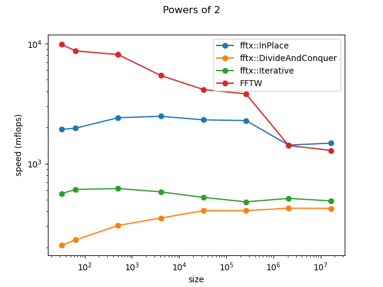

FFTX
===

A template library for Fast Fourier Transform.

Quick example
===

This is a code snipper from `explamples/ex01.cpp`
```
...
using cd = std::complex<double>;
const cd I2Pi = cd{0.0, 1.0} * 2.0 * std::acos(-1.0);

std::vector<cd> A{1.0, 2.0, 3.0, 4.0};

auto FT_A = fftx::FFT_Iterative(A, std::exp(I2Pi * (-1.0 / A.size())));
...
```
It can be built manually with 
```
g++ -std=c++17 examples/ex01.cpp -o ex01 -I include
```


Dependencies
===

None actually. This is header only library.

The following dependencies are needed for building the unit tests:
- [meson](https://mesonbuild.com/)
- [Boost](https://www.boost.org/)

these following libraries are optional, they are needed for the benchmarks:
- [google/benchmark](https://github.com/google/benchmark)
- [FFTW](http://fftw.org/)
- [alglib](https://www.alglib.net/)

How to use this repository
===

This is a header only library, to use it is enough to pass a 
`-I<path to include directory>` compiler flag to your application build instructions.

The full functionality of the repository is achieved by using `meson`
buildsystem tools. For instance:
```
cd <path to build directory>
meson <path to source directory> --prefix=<path to install directory>
```
Unit tests can be run by issuing
```
meson test
```
and the library will be installed in the `<path to install directory>` once you
type
```
meson install
```

Benchmark executables will be built under `benchmarks` directory.

Benchmarks
===

Comparison of double precision complex 1-dimensional DFT for power-of-two sizes,
on Intel(R) Core(TM) i7-9750H CPU @ 2.60GHz. Speed is measured in MFlops,
defined as *5 n log_2(n) /t* where *t* is the time in micro-seconds and *n* is
the size of the transform.


To-do
===
- consider the case when the algebra is non-abelian
- FFT algorithms do not depend on the value of the unity,
thus `const T _1 = T{1}` must be removed.

- Remove FFTW dependencies from this repo.
- add everything to a namespace
- use math from boost library
    https://www.boost.org/doc/libs/1_74_0/boost/algorithm/algorithm.hpp

- test the autoconf tools in an isolated environment

- parallel execution with std::thread 
    use policies to decide if run in serial or parallel
 
- benchmark against FFTW with floating point
- produce example tutorials with:
    - builtin floats
    - number theoretical fft
    - boost::multiprecision
    - boost::quaternions
- write a readme and a license
- document the use, motivation, and theory

- write primitive FFT so that we can compose FFT with those

- Unit test with boost::tests
